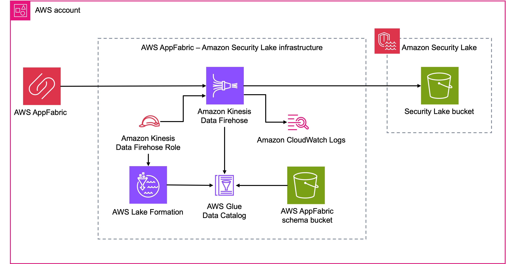

## Build a security monitoring solution with AWS AppFabric and Amazon Security Lake

## Table of contents
1. [About this repo](#About)
2. [Usage guide](#Usage)
3. [Security](#Security)
3. [License](#License)

## About this repo <a name="About"></a>
NOTE: These are sample, non-production-ready templates.

This repository contains templates for AWS CloudFormation and the AWS Cloud Development Kit (CDK) that creates the infrastructure required to connect AWS AppFabric and Amazon Security Lake. You may incur costs in your AWS account after deploying this stack.

The stack includes the following infrastructure services:
- Amazon CloudWatch log group and stream
- Amazon Kinesis Data Firehose
- AWS Glue database and table
- AWS Identity and Access Management (IAM) role and permissions policy
- AWS Lake Formation database and table permissions



## Usage guide<a name="Usage"></a>

### Deploying the resources with CDK

1. Clone this repository to your workstation.
2. Configure the constants at the top of the [appfabric_security_lake/appfabric_security_lake_stack.py](appfabric_security_lake/appfabric_security_lake_stack.py) file with the appropriate values for your environment.

``` python
# The Amazon Resource Name (ARN) of the Security Lake output bucket in your region of choice.
SECURITY_LAKE_S3_BUCKET_ARN = "arn:aws:s3:::DOC-EXAMPLE-DESTINATION-BUCKET"
# The name of your AppFabric custom source in Security Lake
SECURITY_LAKE_CUSTOM_SOURCE_NAME = "AppFabric"
# Name a new Glue database for the AppFabric schema.
GLUE_DATABASE_NAME = "appfabric_schema_db"
# Name a new Glue database table for the AppFabric schema.
GLUE_TABLE_NAME = "appfabric_schema"
# Name a new CloudWatch log group for your Kinesis Data Firehose.
CLOUDWATCH_LOG_GROUP_NAME="/firehose-appfabric-security-lake"
# A unique name for your firehose delivery stream. Optional.
FIREHOSE_DELIVERY_STREAM_NAME=None
```

3. Synthesize the CloudFormation template for this stack. This generates a CloudFormation template that you can examine before you deploy the stack.

```
$ cdk synth
```

4. Deploy the CDK stack to your AWS account.

```
$ cdk deploy
```

### Deleting the stack

Use `cdk destroy` to delete the resources you created with `cdk deploy`.

```
$ cdk destroy
```

### Deploying the resources using CloudFormation

Follow the instructions below to deploy the infrastructure to connect AppFabric and Security Lake with the AWS console.

1. Download the [cloudformation_template/appfabric-glue-firehose-s3.yaml](cloudformation_template/appfabric-glue-firehose-s3.yaml) template file.
2. In your AWS account, navigate to the CloudFormation service console.
3. In the CloudFormation service console, navigate to the stacks area.
4. In the stacks area, create a stack, select the "Upload a template file" option, and then upload the template file.
5. Click on "Next", enter the parameters for your environment, and then follow the steps outlined in the console to deploy the stack.

## Security <a name="Security"></a>

See [CONTRIBUTING](CONTRIBUTING.md#security-issue-notifications) for more information.

## License <a name="License"></a>

This library is licensed under the MIT-0 License. See the LICENSE file.

